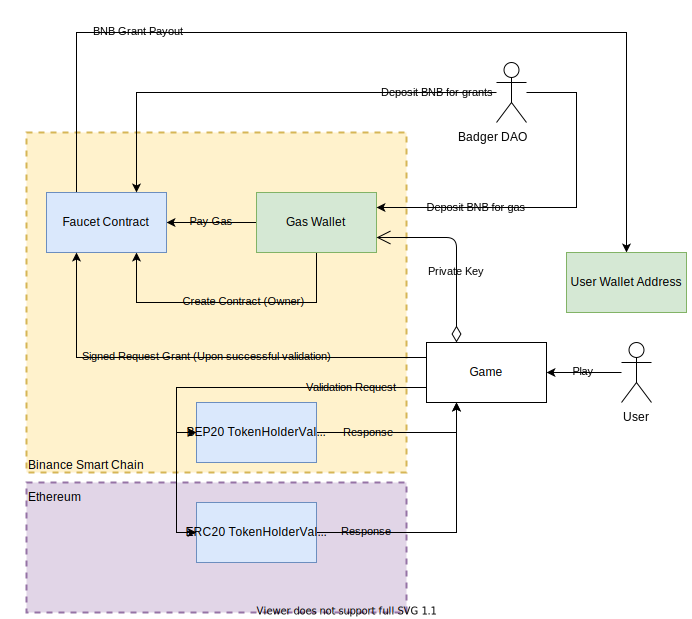

# Badger Rescue Faucet
This is a gamified faucet designed for qualifying members of the badger community that have found themselves stranded on Binance Smart Chain without any BNB to operate with. This happens when users use bridges (like Binance Bridge), but forego/forget acquiring BNB gas funds. Trying to get enough BNB at this point, just to finalize one or two more transactions, can be costly and stressful. So why not try to relax a bit and play a little game? You may earn BNB rewards for a good score, and you can finalize your Binance Smart Chain adventure, without it costing you extra.

### BSC Testnet Demo


**Playable**: http://kraniumtivity.com/Extra/RescueFaucet

**Full Gameplay**: https://youtu.be/VAFihQhIPsw

**Faucet Contract**: [0xEaf4c92BC9Ef176cD29E5d888915A5e12662ea90](https://testnet.bscscan.com/address/0xeaf4c92bc9ef176cd29e5d888915a5e12662ea90) ([source](Brownie/contracts/Faucet.sol))

## Summary
The Badger Rescue Faucet (BRF) is a mini-game that grants BNB to players who are whitelisted for use. Players must try catching coins falling from the clouds before time runs out, all while running across the edge of a cliff without falling off. Successful badgers will claim token amounts based on their performance. Unfortunate badgers will forfeit any collected coins. The coins represent a configurable amount of BNB granted to the players wallet upon winning.

| Win | Lose |
|--|--|
|  |  |

## Technical Overview
### Whitelisting/Validation
To qualify for faucet use, badgers must own at least `10 Wei` of bBadger on both [Ethereum](https://ropsten.etherscan.io/address/0x9143E3Aa6ccC7279713a204970eeCbdD1917c4B5) & [Binance Smart Chain](https://testnet.bscscan.com/address/0xAC762d89beCfaD230856491438321e1296E43960) testnets. 
You can run the [minting brownie script](Brownie/scripts/deployment_test_mint.py) to grant yourself enough tokens


### Deployment Layout
  
The way to run validation/gate-keeping is via the game application itself, since it is network agnostic. The validation happens on-chain with [TokenHolderThresholdValidator](Brownie/contracts/BadgerValidation.sol) contracts. BSC contracts can't directly call Ethereum contracts, so we have the game independently call each network's contracts. It expects both validators to succeed before letting you actually play the game. These validators simply check if you have enough of a particular token to qualify for the faucet (aka, you meet the threshold of tokens held).
At first, the game will prevent you from playing, because you need the qualifying token, which in this case is the [BrownieWrap_Token](Brownie/contracts/BrownieEnvWrappers.sol) (representative of bBadger). In the future, these validators can incorporate [BadgerTree](https://badger-finance.gitbook.io/badger-finance/badger-tree/tree-summary).


### Token Grant Calculation
You can specify the maximum payout amount when creating the smart contract instance on the blockchain. In the current BLF template, the game design has a variable score and total where `score <= total`. The difference between score and total form the ratio that is factored into the max payout:
```
FinalPayout = (Score/Total) * MaxPayout
```

> Due to how fixed point math works in EVM, [the actual implementation](https://github.com/kilogold/BadgerDAO/blob/c711033d526fa48a5fe2d55c356d150b98932592/Contracts/Faucet.sol#L117) in Solidity is refactored.

### Game To Smart Contract Config
Once the smart contract has been manually deployed, the game must be built with the updated smart contract info:

 1. Mainnet/Testnet infura API address.
 2. Faucet smart contract address.
 3. Designated gas wallet address to cover expenses.
 4. Designated gas wallet private key to sign faucet grant transactions.
 > Needless to say, don't save the production private key into the project. You should only enter it manually prior to building the WebGL project.


## Limitations / Pending Improvements

### Game only runs on Chrome
I'm not exactly a web dev so I had to rely on miscelaneous tutorials to get the WebGL properly bootstrapped with Web3 plugins such as Metamask. Brave Browser doesn't work, for example. The Metamask button on the start screen has only worked when running on Chrome with Metamask being the sole Web3 provider installed. More details on this issue to come. 

### Instant Replay Vulnerability
After playing a session (win or lose), the player can bypass the retry delay period simply by reloading the page immediately. A user could do this consecutively to illegitimately boost their rewards, potentially draining the faucet. This happens because time tracking for each player is done via block timestamps in Solidity. The delay period for any player is only updated on the next block. The solution here is to either:
- Query the mempool to validate whether a player has pending payouts (including zero amounts).
- Centralize the deployment by saving some of the game session data on a persistent backend, possibly even the website's own database.

### Overdraft grant transaction failure
There may be multiple players interacting with the faucet simultaneously. Because we only check for balance before starting a game, the faucet may become depleted by another player's payout before your game ends. When requesting your payout, the transaction will fail because there is not enough balance remaining. Similar to above, the solution here is to either:
- Query the mempool for pending payouts and pre-calculate the maximum collective payout to determine if there is enough for a 100% payout game session.
- Centralize the deployment by saving some of the game session data on a persistent backend, possibly even the website's own database.

# Accepting pull requests!

